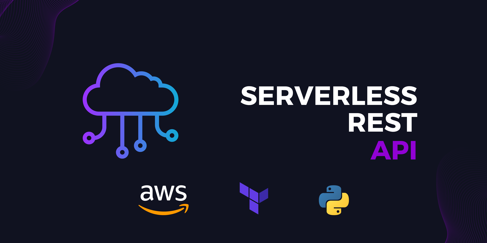

# Serverless REST API
Serverless Rest API created at AWS using Terraform



---


# Description

This project was created by Caio Moretti for the AsCan Academy "AWS Iniciante" trail from Instituto Atlântico.
I had to create a REST API using IaC and some AWS resources

The API developed in **Python** using **AWS Lambda** _serverless_ feature is capable of communicating with a
NoSQL database (**AWS DynamoDB**), allowing for obtaining, registering, modifying, and deleting products
through endpoints created by **AWS API Gateway**. The entire environment was built using an
infrastructure-as-code framework called **Terraform**, meeting all the requirements of the proposed
challenge.

Additionally, the API was subjected to automated testing using the **PyTest** library, ensuring the
validation of the functioning of the services offered. It is important to highlight that the
performance of tests was not a mandatory requirement of the project but rather an additional feature
that was implemented to ensure the quality and reliability of the final product.

# Table of contents

<!-- After you have introduced your project, it is a good idea to add a **Table of contents** or **TOC** as **cool** people say it. This would make it easier for people to navigate through your README and find exactly what they are looking for.
Here is a sample TOC(*wow! such cool!*) that is actually the TOC for this README. -->

- [Project Title](#serverless-rest-api)
- [Description](#description)
- [Table of contents](#table-of-contents)
- [Required Tools](#required-tools)
- [Installation](#installation)
- [Usage](#usage)
- [Development](#development)
- [License](#license)

# Required Tools
[(Back to top)](#table-of-contents)

> There are some tools you will need to run the project correctely:
> 1. [AWS CLI](https://docs.aws.amazon.com/pt_br/cli/latest/userguide/getting-started-install.html)
> 2. [AWS Account](https://aws.amazon.com/pt/premiumsupport/knowledge-center/create-and-activate-aws-account/)
> 3. [Terraform](https://developer.hashicorp.com/terraform/tutorials/aws-get-started/install-cli)
> 4. [Python](https://www.python.org/downloads/)

# Installation

[(Back to top)](#table-of-contents)

To use this project, first clone the repo on your device using the command below:
 ```bash
 git clone https://github.com/Caio-Moretti/Rest-API-AWS.git
 ```
After that, you wil need to configure the **AWS** Configuration using AWS CLI from the account created.
```
aws configure [--profile profile-name]
```
You will need to configure your AWS Account:
```
AWS Access Key ID [****]:
AWS Secret Access Key [****]:
Default region name [us-west-1]:
Default output format [None]:
```

For a guide you can access the [AWS CLI Command Reference](https://docs.aws.amazon.com/cli/latest/reference/configure/)

After that, you will need to run your **Terraform** files

For that you will need to initialize the terraform repository:
```bash
terraform init
```
After that, you can plan your infrastructure provisioning:
```bash
terraform plan -out=plan_out
```
Lastly, you can apply the plan file:
```bash
terraform apply plan_out
```
This will provission your AWS infrastructure. You can check by login into your AWS Account and accessing the
resources created

# Usage
[(Back to top)](#table-of-contents)

After provisioning your infra, you can test your API by running [test_api.py](test_api.py)

First, install PyTest:
```bash
pip install pytest
```
For running your API Tests, you can use the following command on your project terminal:
```bash
pytest -v -s
```
> Also, you can use software programs like Postman or Insomnia to test the API functionalities.

# Development
[(Back to top)](#table-of-contents)

> ### Development Instructions:
> - The code runs the [terraform](terraform) folder when the Terraform apply command is used
> - Every .tf file is ran at the same time, so some depends_on should be used in the code (see [api.tf](terraform/api.tf))
> - After modifying any Terraform file you should run all the terraform commands again.
> - The [test_api.py](test_api.py) file is the test file which is run when the PyTest commands are used

# License
[(Back to top)](#table-of-contents)

<!-- Adding the license to README is a good practice so that people can easily refer to it.
Make sure you have added a LICENSE file in your project folder. **Shortcut:** Click add new file in your root of your repo in GitHub > Set file name to LICENSE > GitHub shows LICENSE templates > Choose the one that best suits your project!
I personally add the name of the license and provide a link to it like below. -->
> ### License Used:
> [MIT License](LICENSE)
---


